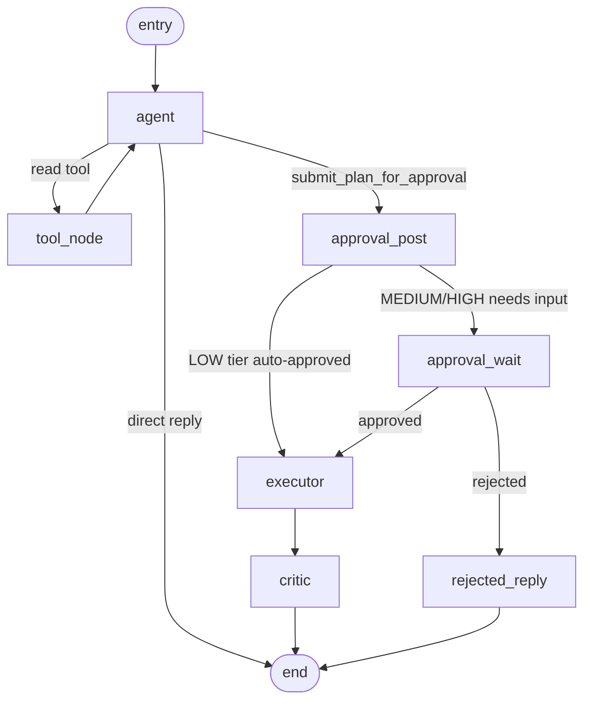

# Lyralabs

> A Python-first, Slack-native autonomous AI coworker. Plans multi-step work,
> calls real tools (GoHighLevel + Google Workspace), pauses for human approval
> on writes, and ships board-ready artifacts (PDFs, charts) back into the
> thread it was asked from.

[](https://www.python.org/)
[](https://fastapi.tiangolo.com/)
[](https://langchain-ai.github.io/langgraph/)
[](#testing)
[](#license)

---

## Table of contents

- [What it does](#what-it-does)
- [Architecture](#architecture)
- [Repository layout](#repository-layout)
- [The agent (LangGraph)](#the-agent-langgraph)
- [Tools](#tools)
- [Channels](#channels)
- [Tenancy and security](#tenancy-and-security)
- [Memory](#memory)
- [Data model](#data-model)
- [Local development](#local-development)
- [Configuration](#configuration)
- [Running migrations](#running-migrations)
- [Useful scripts](#useful-scripts)
- [Testing](#testing)
- [Deployment](#deployment)
- [Day-1 launch blockers](#day-1-launch-blockers)
- [Roadmap](#roadmap)
- [Documentation](#documentation)
- [License](#license)

---

## What it does

You `@mention` the bot in Slack with a real ask:

> *"@ARLO, pull the deals stuck in 'Negotiation' for >7 days from our HighLevel pipeline, draft a follow-up SMS for each, and put it in a Google Doc for me to review."*

The agent runs as a single tool-using LLM (the `agent` node) that:

1. **Replies directly** for smalltalk and questions it can answer without tools — one LLM call, no graph hops.
2. **Calls read tools** (search/list/fetch) freely as it reasons; results loop back through `tool_node` so the model can incorporate them.
3. **Submits a Plan for approval** via the `submit_plan_for_approval` meta-tool whenever the work involves writes (creating docs, sending SMS, booking appointments). Posts a Block Kit preview to the same thread and pauses via `interrupt()`.
4. On *Approve*, **executes** each step in dependency order, resolving `{{ step_1.field }}` placeholders into later step args.
5. **Lifts artifacts** (PDFs, PNG charts) generated by tools onto state and uploads them as Slack files.
6. **Critiques** the result, posts a friendly summary back, and records every tool call to an append-only audit log.

All durably checkpointed in Postgres so an approval pause can survive worker restarts and the agent can be resumed hours later from where it stopped.

---

## Architecture

```
       Slack             ┌────────────────────────────┐                arq worker
   ─── WebSocket ──────► │  socket_listener (VM)      │ ─ enqueue ──► ┌─────────────────────┐
   (Socket Mode,         │  AsyncSocketModeHandler    │               │  apps/worker        │
    persistent,          └────────────────────────────┘               │  run_agent task     │
    no 3s ack)                                                        │  resume_agent task  │
                                                                      └─────────┬───────────┘
       Slack             ┌────────────────────────────┐                         │
   ─── HTTPS ──────────► │  apps/api  (Cloud Run)     │ ─ enqueue ─►            │
   /oauth/slack/*        │  - /oauth/{slack,google,…} │                         │
   /webhooks/stripe      │  - /webhooks/stripe        │                         │
   /admin/*  (REST)      │  - /admin/*                │                         │
                         │  - /slack/events (fallback)│                         │
                         └──────────────┬─────────────┘                         │
                                        ▲                                       ▼
                                        │ CORS                       ┌────────────────────────┐
            Vite SPA (separate repo: ../lyralabs-admin-ui)           │  LangGraph agent       │
                                                                     │  agent ◄──► tool_node  │
                            ┌──────────────┐                         │  agent ─► approval     │
                            │  Postgres    │ ◄──── checkpoints ────► │   ─► executor ─► critic│
                            │  + Alembic   │                         │                        │
                            │  + LangGraph │                         └─────────┬──────────────┘
                            │  checkpointer│                                   │
                            └──────────────┘                                   │
                                    ▲                                          ▼
                                    │                              ┌──────────────────────┐
                            ┌──────────────┐                       │  Tools               │
                            │  Audit log   │ ◄─── tool_call event ─│  slack.*  (history,  │
                            │              │                       │   users, search,     │
                            │  IntegrConn  │ ──── creds ──────────►│   canvas)            │
                            │  (encrypted) │                       │  google.* (Drive,    │
                            └──────────────┘                       │   Docs, Sheets, Cal) │
                                                                   │  ghl.*    (Contacts, │
                                                                   │   Pipelines, SMS)    │
                                                                   │  artifact.* (PDF,    │
                                                                   │   chart.line, .bar)  │
                                                                   └──────────┬───────────┘
                                                                              │
                                                                              ▼
                                                                       Slack file upload
                                                                       (PDF / PNG)
```

**Three deployable processes in this repo**

| Service           | Tech            | Runs on                                | Responsibility                                                                  |
| ----------------- | --------------- | -------------------------------------- | ------------------------------------------------------------------------------- |
| `api`             | FastAPI 0.115   | Cloud Run (`lyralabs-app`)             | OAuth callbacks (Slack, Google, GHL), Stripe webhooks, admin REST API. Also serves `/slack/events` as an HTTPS fallback if Socket Mode is disabled. |
| `worker`          | arq 0.26        | GCE VM (`lyralabs-worker`, `e2-medium`) | Run the LangGraph agent for each enqueued user request; resume on approval.    |
| `socket_listener` | slack_bolt async | Same VM, sidecar container            | Maintain the persistent Slack Socket Mode WebSocket and enqueue `run_agent` tasks. Idle-no-op when `SLACK_APP_TOKEN` is empty so deploys without the token don't crash-loop. |

All three services share **one Docker image** built from the root `Dockerfile` —
they're just three different commands. The VM hosts the Redis broker
(`lyralabs-redis`) that all three talk to (see [`infra/vm/`](infra/vm/));
this hybrid topology keeps OAuth + Stripe webhooks on Cloud Run's
HTTP-shaped scale-to-N, while the always-on Slack listener and the
arq worker live where polling is cheap.

**Why three separate processes, not one?**

- **API must be on Cloud Run** — it needs a public HTTPS URL for OAuth callbacks and Stripe webhooks, and benefits from Cloud Run's scale-to-zero when idle.
- **Socket listener must be always-on** — it holds a single persistent WebSocket to Slack. Cloud Run kills instances when idle, which would drop the connection. It lives on the VM so it's always running.
- **Worker must be separate from the socket listener** — agent jobs take 30–90 seconds (LLM calls, tool chains, approval waits). If the worker and socket listener shared a process, a slow job would block new Slack events from being received. Keeping them separate means a crashed or busy worker never affects message intake.

All three share one Docker image — they're just different `CMD` arguments at runtime.

**Why Socket Mode for inbound events.** The HTTPS webhook path retries an
event up to 3× when a 2xx isn't returned within 3 s, which on Cloud Run
cold starts produced retry storms (4× duplicate `run_agent` tasks for one
DM). Socket Mode streams events over a persistent WebSocket — no 3-s-ack
cliff, no public ingress for inbound, no cold-start tax. OAuth still
flows over HTTPS, because the install callback is per-workspace and
needs a public URL.

**Admin UI (separate repo)**

The operator panel — a Vite + React 18 + React Router + Tailwind SPA — lives
in [`../lyralabs-admin-ui`](../lyralabs-admin-ui/) and ships to **Vercel** as a
static site. It calls this API cross-origin; the FastAPI CORS allow-list
(`ADMIN_BASE_URL`) must include the deployed UI's origin (e.g.
`https://lyralabs.vercel.app`).

**Backing services**

- Postgres 16 (tenants, users, integrations, jobs, audit, LangGraph checkpoints) — Supabase pooler in prod.
- Redis 7 (arq job queue) — self-hosted on the worker VM via `docker compose` (AOF persistence, AUTH password, `allkeys-lru`). Migrate to Upstash / Memorystore later if SLAs demand it.
- Qdrant (per-tenant vector index) — Qdrant Cloud or self-hosted.
- Stripe (subscriptions + portal).
- LiteLLM router — currently Qwen (`dashscope/qwen-max` primary, `dashscope/qwen-turbo` cheap) + OpenAI for embeddings. Anthropic Claude / Gemini Flash are drop-in alternatives via `LLM_PRIMARY_MODEL` / `LLM_CHEAP_MODEL`.

---

## Repository layout

```
lyralabs/
├── apps/
│   ├── api/                       FastAPI app
│   │   ├── main.py                Mounts Slack OAuth, other OAuth, Stripe, admin routers
│   │   ├── stripe_webhook.py      Handles subscription / invoice events
│   │   ├── admin/
│   │   │   ├── auth.py            JWT-bearing admin principal dependency
│   │   │   ├── auth_routes.py     POST /register (auto-creates Tenant + Client), POST /login, GET /slack-install-url
│   │   │   └── routes.py          /me, /integrations, /jobs, /audit, /cost, /billing/*
│   │   └── oauth/
│   │       ├── _state.py          Signed JWT state for OAuth round-trips (used by Google, GHL, and Slack install)
│   │       ├── google.py          /oauth/google/{install,callback}
│   │       └── ghl.py             /oauth/ghl/{install,callback}
│   ├── worker/                    arq async job queue
│   │   ├── arq_app.py             WorkerSettings (functions, cron, max_tries, redis_settings)
│   │   └── tasks/run_agent.py     run_agent + resume_agent async task functions
│   └── socket_listener/           Slack Socket Mode runner
│       └── main.py                AsyncSocketModeHandler entrypoint; idle-no-op when SLACK_APP_TOKEN is empty
│
│   (The admin UI lives in a sibling repo: ../lyralabs-admin-ui)
│
├── packages/
│   └── lyra_core/             Shared library
│       ├── common/
│       │   ├── config.py          pydantic-settings: env + provider scopes (incl. SLACK_APP_TOKEN)
│       │   ├── crypto.py          HKDF per-tenant Fernet key derivation
│       │   ├── llm.py             LiteLLM router + cost extractor
│       │   ├── audit.py           Append-only audit log helper
│       │   └── logging.py         Structlog config + phase() context manager + bind_job_context()
│       ├── db/
│       │   ├── models.py          SQLAlchemy 2.0 ORM (Tenant, User, IntegrationConnection, …)
│       │   └── session.py         Async engine + FastAPI dependency
│       ├── channels/
│       │   ├── schema.py          InboundMessage / OutboundReply / Artifact (channel-agnostic, with agent_thread_id)
│       │   ├── slack/
│       │   │   ├── adapter.py     build_slack_app (HTTPS) + build_socket_mode_app (WebSocket), shared handlers
│       │   │   ├── install_store.py  Postgres-backed InstallationStore (encrypted tokens, cache-invalidating)
│       │   │   └── poster.py      Outbound poster + 10-min bot-token cache
│       │   └── teams/adapter.py   Phase-2 placeholder
│       ├── tools/
│       │   ├── base.py            Tool[InputT, OutputT] interface, ApprovalRequired, ToolError
│       │   ├── registry.py        default_registry + auto-discovery via package import
│       │   ├── credentials.py     ProviderCredentials loader + refresh (Google + GHL)
│       │   ├── slack/             conversations, users, search, canvas (mirrors mcp.slack.com)
│       │   ├── google/            drive, docs, sheets, calendar (+ _client builders)
│       │   ├── ghl/               client, contacts, pipelines, conversations, calendars
│       │   └── artifacts/         pdf (markdown→HTML→WeasyPrint), chart (Plotly + kaleido)
│       ├── worker/
│       │   └── queue.py           enqueue_run_agent / enqueue_resume_agent (arq pool helpers)
│       └── agent/
│           ├── state.py           AgentState TypedDict + Plan / PlanStep / StepResult
│           ├── memory.py          4-tier memory (workspace facts cached 30 s + Qdrant collection)
│           ├── checkpointer.py    LangGraph Postgres checkpointer wrapper (process-scoped pool singleton)
│           ├── graph.py           Wires the StateGraph
│           └── nodes/             agent (with history-trim + plan-time arg validation), tool_node, approval_post, approval_wait, executor, critic, artifact
│
├── tests/
│   ├── conftest.py                Env shim + shared fixtures (mock_session, make_ctx, patch_chat …)
│   ├── unit/  (523 tests)         One test file per source module — see Testing section
│   ├── regression/ (31 tests)    Named regression_test1–7.py; run via `make test-regression`
│   └── integration/               Reserved for tests that need real Postgres
│
├── infra/
│   ├── docker-compose.yml         Local: postgres + redis + qdrant + api + worker + socket_listener
│   ├── vm/docker-compose.yml      Production VM: redis + worker + socket_listener
│   ├── cloud-run/                 service.yaml per service for `gcloud run deploy`
│   ├── github-actions/            CI: lint + test + build + deploy
│   └── slack-app-manifest.yml     Slack App Directory manifest
│
├── docs/
│   ├── google-oauth-verification.md  Sensitive-scope verification (do this immediately)
│   ├── slack-app-directory-checklist.md
│   ├── launch-runbook.md          Beta launch playbook
│   ├── demo-scenarios.md          Concrete prompts for testing each phase
│   └── roadmap-phase-2.md         Teams, Stripe-as-a-tool, FB BM, voice via LiveKit
│
├── scripts/
│   └── mint_admin_jwt.py          Dev-only: mint an admin JWT for a tenant
│
├── alembic.ini                    Migrations config
├── Makefile                       gen-key, dev, migrate, test, test-regression, lint, type, fmt
├── pyproject.toml                 uv/hatch project + ruff + mypy + pytest config
└── .env.example                   Full env var template
```

---

## The agent (LangGraph)



| Node             | Tier    | Role                                                                                                                |
| ---------------- | ------- | ------------------------------------------------------------------------------------------------------------------- |
| `agent`          | Primary | Single tool-using LLM. Replies directly, calls read tools, or emits a Plan via `submit_plan_for_approval`. Validates step args against each tool's input schema before routing — rejects the plan and re-prompts the model if any step would fail at execution time (e.g. missing required fields). |
| `tool_node`      | —       | Executes read-tool calls and feeds results back into `agent`. Rejects any direct write-tool call (security guard).  |
| `approval_post`  | —       | Classifies trust tiers, runs concurrent rehearsal, posts the Block Kit preview card, and checkpoints. LOW-only plans auto-approve here. MEDIUM/HIGH plans set `needs_approval_wait=True` and route to `approval_wait`. |
| `approval_wait`  | —       | **Only node that calls `interrupt()`.** Because `approval_post` already completed and was checkpointed at the node boundary, LangGraph resumes here on button click — the card is never re-posted. |
| `executor`       | —       | Walks approved plan steps in order, resolves `{{ step_X.field }}` placeholders, runs `tool.safe_run()`.             |
| `critic`         | Primary | Validates results against the original ask, writes a friendly summary, attaches artifacts.                          |
| `rejected_reply` | —       | Acknowledges rejection and asks what to change.                                                                     |

**Why two approval nodes?** LangGraph re-runs an entire node body when resuming from `interrupt()`. If the card post and the interrupt lived in the same node, clicking Approve caused the card to be re-posted (duplicate with live buttons) before the interrupt returned. Splitting into a post-then-checkpoint node and a wait-only node eliminates the re-post entirely — the post is past the checkpoint boundary and never re-executed on resume.

**State** (`AgentState`, TypedDict, total=False):
```
tenant_id, job_id, channel_id, thread_id, user_id, user_request,
plan, pending_plan, needs_approval_wait, step_results, approval_decision,
final_summary, artifacts, error, total_cost_usd, messages
```

**Checkpointing**: every node return is persisted by the LangGraph Postgres checkpointer keyed by `thread_id`. When `interrupt()` fires inside `approval_wait`, the worker exits cleanly and the graph can be resumed days later via `Command(resume={"decision": "approved"})`.

**Resume deduplication**: `resume_agent` atomically flips `job.status` from `awaiting_approval` to `resuming` in a single `UPDATE … WHERE status='awaiting_approval' RETURNING id`. If two button clicks arrive concurrently, exactly one wins — the loser sees 0 affected rows and returns `already_processed` before acquiring the Redis thread lock or running the graph.

---

## Tools

Every tool is a `Tool[InputT, OutputT]` with a Pydantic input/output schema, a unique name, and an optional `requires_approval` flag. They self-register in `default_registry` at import time, and the agent's tool catalog is generated from that registry — new tools light up automatically.

The base `Tool` class exposes a `validate_args(args: dict) -> str | None` method that type-checks a proposed args dict against `self.Input` before plan submission. Returning a non-None error string causes `agent_node` to feed the error back to the LLM as a tool-response message in the same turn, prompting it to resubmit with complete args. This catches missing required fields (e.g. `email`, `firstName` for GHL contact creation) before the user ever sees an approval card for an unexecutable plan.

### Read-only (no approval)

| Tool                              | What it does                                                              |
| --------------------------------- | ------------------------------------------------------------------------- |
| `slack.conversations.history`     | Read recent messages from a channel/DM (older context not in live state). |
| `slack.conversations.replies`     | Read every message in a specific Slack thread.                            |
| `slack.users.info`                | Look up a single user's profile by id (resolves `U…` to a name + email).   |
| `slack.users.list`                | Paginated workspace member directory; resolves a name back to a user id.  |
| `slack.search.messages`           | Workspace-wide message search. Uses the **user** token (Slack disallows bot tokens here); surfaces a clean missing-scope error if the workspace was installed without `search:read.*` user scopes. |
| `google.drive.search`             | Full-text Drive search with optional MIME filter.                         |
| `google.drive.read`               | Read file content. Native docs auto-export to `text/plain` or `text/csv`. |
| `google.sheets.read`              | Read an A1 range; returns rows + dimensions.                              |
| `ghl.contacts.search`             | Search by name / email / phone, capped to `pageLimit`.                    |
| `ghl.pipelines.opportunities`     | List opportunities; supports `stuck_for_days` filter.                     |

### Write (require approval)

| Tool                              | What it does                                                              |
| --------------------------------- | ------------------------------------------------------------------------- |
| `slack.canvas.create`             | Create a Slack canvas (rich shareable doc) from markdown, optionally attached to a channel. |
| `google.docs.create`              | Create a Doc with a title + body, optionally move to a Drive folder.      |
| `google.sheets.append`            | Append rows to a Sheet (`USER_ENTERED` or `RAW`).                         |
| `google.calendar.create_event`    | Insert an event with attendees + sendUpdates=all.                         |
| `ghl.contacts.create`             | Create a contact (requires email or phone).                               |
| `ghl.conversations.send_message`  | SMS or Email to a contact (subject required for Email).                   |
| `ghl.calendars.book_appointment`  | Book a confirmed appointment with a contact.                              |

The Slack tools mirror the surface of the official `mcp.slack.com` MCP
server but live in-process: ARLO is already the Slack app, so going
through MCP's JSON-RPC-over-HTTP transport would just be calling our
own server from our own process. The tool layer keeps a typed
`SlackTokenMissing` exception so the agent can degrade gracefully (e.g.
"the workspace was installed without search scopes; please re-authorize")
instead of crashing on missing bot/user tokens.

### Artifact generators

| Tool                              | What it does                                                              |
| --------------------------------- | ------------------------------------------------------------------------- |
| `artifact.pdf.from_markdown`      | Markdown → HTML (mini parser) → WeasyPrint A4 PDF. Side-effect: lifts onto `state.artifacts`. |
| `artifact.chart.line`             | Multi-series Plotly line chart → PNG via kaleido.                         |
| `artifact.chart.bar`              | Single-series Plotly bar chart → PNG via kaleido.                         |

The executor lifts whatever the tool put into `ctx.extra["artifacts"]` onto the agent's `state.artifacts`, and the critic node attaches them to the outbound Slack reply (`files_upload_v2`).

### MCP tool discovery (GHL + Slack)

GHL tools are discovered at job start via GoHighLevel's official MCP server (`https://services.leadconnectorhq.com/mcp/`). The LangChain `MultiServerMCPClient` connects once per job, fetches the tool list, and each tool is wrapped in a `McpToolAdapter` that's registered in the global tool registry.

Key design decisions:

- **Per-tool `Input` schema.** Each adapter's `Input` ClassVar is set to the per-tool Pydantic model built by LangChain from the MCP server's `inputSchema` — *not* a generic `arguments: dict` envelope. The generic envelope was the original design but silently dropped all args on Pydantic v2's default `extra='ignore'` setting, meaning every MCP write call sent `{}` to GHL and got back a 422 regardless of what was in the plan. Using the real schema means `tool.Input(**step.args)` both validates and passes the fields through.
- **`validate_args` dispatch.** The base `Tool.validate_args(args: dict)` checks `self.Input`. Since MCP tool adapters now carry the real per-tool schema as `Input`, no override is needed.
- **`exclude_unset=True` on execution.** `run()` calls `args.model_dump(exclude_unset=True, exclude_none=True)` before passing to `tool.ainvoke()`, so optional-with-default fields don't appear as `null` in the MCP payload.
- **Trust classification.** Write tools (`contacts_create-contact`, `contacts_update-contact`, etc.) are listed in `MCP_SERVER_CONFIGS["ghl"].write_tools` → MEDIUM tier (Approve/Reject button). `conversations_send-a-new-message` is HIGH tier (text confirmation). Everything else defaults LOW and executes freely.
- **24-hour discovery cache.** Tool discovery is cached per `(tenant_id, client_id, server_key)` to avoid hammering the MCP server on every job. Log line `mcp.tools_discovered` records count and server on each cache miss.

The Slack MCP server (`mcp.slack.com`) is also wired — useful for workspaces where ARLO doesn't have a direct bot token but does have an MCP credential. The in-process Slack tools (see above) remain the primary path.

`tools/ghl/client.py` (used by the legacy in-process GHL tools before the MCP migration) is a thin async httpx wrapper still used for custom GHL calls that aren't yet exposed by the MCP server:

- Adds `Authorization`, `Version: 2021-07-28`, `Accept: application/json` headers.
- Retries on `429` and `5xx` with `tenacity` exponential backoff (max 3 attempts).
- Raises `ToolError` on `4xx` (other than 429), returns parsed JSON otherwise.

### Google transport

`tools/google/_client.py` builds googleapiclient services from a `ProviderCredentials`. All synchronous Google calls run via `asyncio.to_thread` so they never block the event loop.

---

## Channels

```python
class InboundMessage(BaseModel):
    surface: Surface             # "slack" | "teams"
    tenant_external_id: str      # T0123 (Slack team_id)
    channel_id: str              # C0123 / D0123
    thread_id: str               # Slack thread_ts (or msg ts) — for audit
    agent_thread_id: str         # LangGraph checkpointer key. See below.
    user_id: str                 # U0123
    text: str
    files: list[dict] = []
    reply_thread_ts: str | None  # how the bot threads its reply (UX)
    is_dm: bool = False
    raw: dict = {}
```

`agent_thread_id` is the key for the LangGraph checkpointer (the agent's
memory). Computed by the adapter:

- **DM**: `slack:dm:{team}:{channel}:{user}` — one continuous agent thread
  per (team, DM channel, user). Top-level DM messages share memory, so
  ARLO remembers what you said in a prior message even if you didn't
  thread it. (Originally the key was per-message-ts and reset every
  turn, which caused the "ARLO can't remember my name across two DMs" bug.)
- **Channel @-mention / thread reply**: `slack:ch:{team}:{channel}:{thread_root}`
  where `thread_root = thread_ts or msg_ts`. One agent memory per Slack
  thread; new threads start fresh.

Reply threading (`reply_thread_ts`) is independent of the agent key:
it's purely a UX choice (DM top-level reply gets posted top-level;
channel mention gets threaded under the user's message).

### Slack transport

The Slack adapter ([`channels/slack/adapter.py`](packages/lyra_core/channels/slack/adapter.py))
exposes two builders:

- `build_slack_app()` — used by the FastAPI `/slack/events` HTTPS
  endpoint and the OAuth install flow. Includes a retry-dropping
  middleware so Slack's 3-s-ack retries don't enqueue duplicate
  `run_agent` tasks.
- `build_socket_mode_app()` — used by [`apps/socket_listener/main.py`](apps/socket_listener/main.py)
  to maintain a persistent WebSocket. Same event handlers as the HTTPS
  app; events bypass the 3-s-ack mechanism entirely. Multi-tenant by
  design — the Slack App-Level Token is per-app, and per-event
  authorization still flows through the `PostgresInstallationStore`.

The Teams adapter is a stub for Phase 2; the channel-agnostic schema
means the agent core needs no changes to support it.

---

## Tenancy and security

- **Per-tenant token encryption.** Every OAuth access/refresh token is encrypted with a Fernet key derived per-tenant via HKDF-SHA256 from a single master key. A bug in tenant `A` cannot decrypt tenant `B`'s tokens (verified in `test_crypto.py::TestTenantIsolation`).
- **Append-only audit log.** Every tool call records `tenant_id`, `actor_user_id`, `job_id`, `tool_name`, SHA-256 args hash, cost, and status. Optionally store raw args (off by default for privacy).
- **Registration-first onboarding.** Users register at the admin UI (email + password + passcode) — no Slack team ID required. Registration auto-creates a `Tenant` and a synthetic `agency_internal` `Client` in one transaction. The onboarding checklist then guides: Connect Slack → Connect Google → Connect GoHighLevel → Mention @ARLO.
- **JWT admin auth.** The admin REST API requires `Authorization: Bearer <jwt>` signed with `ADMIN_JWT_SECRET`, with `tenant_id` and `email` claims, scoped strictly to the caller's tenant.
- **Signed Slack install URL.** `GET /admin/auth/slack-install-url` (authenticated) returns a 10-minute signed URL containing the caller's `tenant_id`. The install handler (`_TenantAwareOAuthFlow`) verifies the signature and stores `state→tenant_id`; on callback the pending tenant is linked to the real Slack workspace. An unsigned `?tenant_id=` query param is never trusted — this closes the CSRF-style binding attack where a crafted link could attach a victim's Slack workspace to the wrong tenant.
- **Signed OAuth state.** All OAuth round-trips (Google, GHL, Slack) carry a 10-minute JWT `state` so a callback on a stolen URL can't attach to the wrong tenant.
- **Approval gate.** Any tool with `requires_approval=True` triggers `interrupt()`; nothing mutates without an explicit Slack button click.
- **Trial credit limit.** Each tenant gets `STRIPE_TRIAL_CREDIT_USD` (default $100) of free LLM + tool spend, tracked via the audit log's `cost_usd`.

---

## Memory

Four tiers, all per-tenant:

1. **Working memory** — LangGraph state for the current turn. Volatile.
2. **Session memory** — LangGraph Postgres checkpointer keyed by
   `agent_thread_id`. Survives interrupts. DMs use one stable key per
   `(team, channel, user)` so memory is continuous across top-level
   messages; channels are scoped per Slack thread root. The agent node
   re-injects only the most recent 20 messages into the LLM prompt
   (with tool-call/tool-result pairs kept intact) so cost stays bounded
   as a long DM grows — the checkpointer still persists everything for
   audit, only the LLM input is trimmed.
3. **Workspace memory** — Durable per-tenant facts (`team_slug`, default
   Drive folder, etc.) in `tenants.settings.facts` JSONB. Helpers:
   `get_workspace_facts(tenant_id)` / `upsert_workspace_fact(tenant_id, key, value)`.
   Cached in-process for 30 s (admin edits invalidate automatically) so
   a multi-iteration agent loop doesn't re-fetch on every turn.
4. **Semantic memory** — Per-tenant Qdrant collection `tenant_<uuid>` for
   RAG over their docs. `ensure_tenant_collection()` is idempotent.

Slack bot tokens are also cached in-process (10 min TTL) keyed by
`tenant_id`; OAuth save and bot-token-refresh paths invalidate the
cache automatically so a freshly rotated token is picked up immediately
instead of after the TTL.

### Observability — `phase()` timing

Every long step in the request path emits a structured `phase.start` /
`phase.end` pair via [`common/logging.py::phase`](packages/lyra_core/common/logging.py),
with a `duration_ms` and a `phase_ok` flag. `bind_job_context()` stamps
`job_id` / `thread_id` / `tenant_id` onto every line in the task, so
one task can be reconstructed end-to-end with
`grep job_id=<uuid> /var/log/...`.

Instrumented phases:

- `slack.event.enqueue` (with `ingress_lag_ms` from Slack's `event_ts`)
- `worker.tenant_lookup_and_job_insert`, `worker.checkpointer_open`,
  `worker.graph_invoke`, `worker.mark_job_done`
- `agent.workspace_facts_fetch`, `agent.llm_call` (with token counts +
  cost), `agent.post_reply`, `agent.tool_call` (per tool),
  `agent.tool_audit_write`
- `slack.token_fetch`, `slack.chat_postMessage`, `slack.files_upload_v2`
- `run_agent.task_total` line at the end with the wall-clock total +
  total cost.

---

## Data model

```
tenants ◄──┬─── users
           ├─── slack_installations
           ├─── integration_connections   (provider: "google" | "ghl" | …)
           └─── jobs ─── audit_events
```

Notable details:

- `Tenant.external_team_id` is unique → maps to Slack `team_id` or Teams tenant id. Until Slack is connected it holds `"pending-{user_id}"` as a placeholder (set at registration); the install callback replaces it with the real `team_id`.
- `Client` — every Tenant gets a synthetic `Client(slug='agency_internal')` created at registration time (same transaction as the Tenant). Credential lookups and client-scoped queries always have a row to bind to from day one.
- `IntegrationConnection` has a unique `(tenant_id, provider, external_account_id)` — re-auth updates in place.
- `Job.thread_id` is the LangGraph thread key; `(tenant_id, thread_id)` are indexed for cheap admin lookups.
- `AuditEvent` has a composite `(tenant_id, ts)` index for the per-tenant timeline view.

Migrations live in `packages/lyra_core/db/migrations/` (Alembic) and are run via `make migrate`.

---

## Local development

### Prerequisites

- Docker Desktop (Postgres + Redis + Qdrant + api + worker)
- Python 3.14+ (only needed if you want to run pytest / scripts on the host)
- Node 20+ (only for the admin-ui — `npm run dev` in `../lyralabs-admin-ui`)
- `uv` (fast pip alternative, optional but recommended)

### Boot the stack

```bash
# 1. Generate a Fernet key + copy env template
make gen-key                     # paste output into .env
cp .env.example .env             # then fill in Slack/Google/GHL/DashScope/OpenAI creds

# 2. Bring up Postgres + Redis + Qdrant + api (uvicorn --reload) + worker
docker compose -f infra/docker-compose.yml up --build

# 3. Apply migrations (in another terminal)
docker compose -f infra/docker-compose.yml exec api alembic upgrade head

# 4. (separate repo) Run the Vite admin UI on :5173 with /admin /oauth
#    /webhooks proxied to FastAPI on :8000.
cd ../lyralabs-admin-ui && npm install && npm run dev
```

The api will be at `http://localhost:8000` (`/healthz`, `/readyz`, `/docs` for Swagger UI). The admin UI runs in its own repo at `http://localhost:5173`.

### Install dev deps locally (for fast unit tests outside docker)

```bash
uv venv .venv
source .venv/bin/activate
uv pip install -e ".[dev]"
make test                         # 523 tests, ~8s
```

---

## Configuration

Every setting is loaded from environment variables via `pydantic-settings` in `packages/lyra_core/common/config.py`. The full list lives in `.env.example`; the most important ones:

| Var                              | Required | Notes                                                                |
| -------------------------------- | -------- | -------------------------------------------------------------------- |
| `MASTER_ENCRYPTION_KEY`          | ✅       | Base64 Fernet key. **Generate via `make gen-key`. Rotate via `reencrypt_with_rotation`.** |
| `DATABASE_URL` / `..._SYNC`      | ✅       | asyncpg + psycopg variants for app + Alembic.                        |
| `CELERY_BROKER_URL` | ✅ | Redis URL for the arq job queue. In prod points at the worker VM's Redis. Locally docker-compose wires `redis://redis:6379/1`. |
| `DASHSCOPE_API_KEY`              | ✅       | Primary + cheap tier (Qwen via DashScope).                           |
| `OPENAI_API_KEY`                 | ✅       | Embeddings (`text-embedding-3-small`) — no chat usage on the MVP path.|
| `LLM_PRIMARY_MODEL`              |          | Default `dashscope/qwen-max`. Any LiteLLM-supported model.           |
| `LLM_CHEAP_MODEL`                |          | Default `dashscope/qwen-turbo`.                                      |
| `SLACK_CLIENT_ID/SECRET/SIGNING_SECRET` | ✅ for Slack channel | Without them the api boots in stub mode (no /oauth/slack). |
| `SLACK_SCOPES`                   | ✅ for Slack channel | Bot scopes requested at install. Defaults include `mpim:history`, `users:read.email`, `canvases:read/write` for the new tools. |
| `SLACK_USER_SCOPES`              | optional | User scopes (`xoxp-` token). Required only for `slack.search.messages` (`search:read.*`). Empty = the search tool surfaces a clean "missing permission" error. |
| `SLACK_APP_TOKEN`                | optional | App-Level Token (`xapp-…`, scope `connections:write`). Set this to enable Socket Mode; leave empty and the `socket_listener` container stays idle while the HTTPS `/slack/events` path remains active. |
| `GOOGLE_OAUTH_CLIENT_ID/SECRET`  | ✅ for Google | Plus `GOOGLE_OAUTH_REDIRECT_URI` and the scope CSV.              |
| `GHL_CLIENT_ID/SECRET`           | ✅ for GHL | Marketplace credentials.                                              |
| `STRIPE_*`                       | ✅ for billing | Secret key, webhook secret, monthly price id.                    |
| `ADMIN_JWT_SECRET`               | ✅       | Signs both admin JWTs and OAuth state JWTs.                          |
| `ADMIN_BASE_URL`                 | ✅       | Origin of the deployed admin UI (added to CORS allow-list).          |
| `QDRANT_URL/API_KEY`             | ⚠️       | Only needed when you wire RAG.                                       |

`APP_ENV=test` is read by pytest fixtures; arq task functions are plain `async def` so tests call them directly without a broker.

`LLM_PRIMARY_MODEL` / `LLM_CHEAP_MODEL` are now **bootstrap-only** — once an operator configures providers via the super-admin UI (`/admin/llm/...`), the runtime values in Postgres take over. See the next section.

---

## LLM provider switching (super-admin)

Models are no longer hard-coded to a single vendor. The platform super-admin can switch the live `primary` / `cheap` / `embedding` model at runtime — no redeploy — across any provider in [`packages/lyra_core/llm/catalog.py`](packages/lyra_core/llm/catalog.py): Qwen, DeepSeek, OpenAI, Anthropic, Gemini, Moonshot/Kimi, MiniMax, Z.AI/GLM. Adding a new provider after a release announcement is one entry in the catalog.

**Architecture (3 pieces):**

1. **`packages/lyra_core/llm/catalog.py`** — declarative registry. Model id (LiteLLM format), default endpoint, context window, tier hint. Pure data, no DB.
2. **DB tables** (`llm_providers` + `llm_model_assignments`, migration `0002`) — encrypted credentials per provider, plus a singleton row per tier saying which `(provider, model)` is live.
3. **`packages/lyra_core/llm/router.py`** — runtime resolver with a 30-s in-process cache; `common.llm.chat()` calls into it and passes `api_key=` / `api_base=` per call (no env-var mutation, prefork-safe). Falls back to env vars if no DB row exists, so the migration is safe to ship before the operator touches anything.

**REST API** (gated by `role: "super_admin"` in the JWT):

| Method | Path | Purpose |
|--------|------|---------|
| `GET` | `/admin/llm/catalog` | All providers + known models the code knows about. |
| `GET` | `/admin/llm/providers` | Catalog merged with DB state (configured / has_api_key / last test). Never returns the API key. |
| `PUT` | `/admin/llm/providers/{key}` | Set or clear the API key, optional `api_base`, `extra_config`. |
| `DELETE` | `/admin/llm/providers/{key}` | Remove credentials (rejected with 409 if still assigned to a tier). |
| `POST` | `/admin/llm/providers/{key}/test` | Send a 4-token ping to verify the credentials. |
| `GET` | `/admin/llm/active` | Current tier → model assignments. |
| `PUT` | `/admin/llm/active/{tier}` | Switch the live model for `primary` / `cheap` / `embedding`. |
| `DELETE` | `/admin/llm/active/{tier}` | Clear the assignment, falling back to env vars. |

Every write invalidates the router cache, so the change propagates to all worker processes within 30 s without any out-of-band signal.

**Bootstrapping the first super-admin:**

```bash
python scripts/mint_admin_jwt.py --tenant <ANY_TENANT_UUID> --email you@platform.com --role super_admin
```

Then in the admin UI, hit `PUT /admin/llm/providers/qwen` with your DashScope key, `PUT /admin/llm/providers/deepseek` with your DeepSeek key, then `PUT /admin/llm/active/primary` to point at e.g. `dashscope/qwen-max` and `PUT /admin/llm/active/cheap` to point at `deepseek/deepseek-chat`. Done — the next message ARLO receives uses the new models.

---

## Running migrations

```bash
# Create a new migration after editing models.py
docker compose -f infra/docker-compose.yml exec api \
    alembic revision --autogenerate -m "describe change"

# Apply
make migrate
# or
docker compose -f infra/docker-compose.yml exec api alembic upgrade head
```

---

## Useful scripts

```bash
# Mint an admin JWT for the local admin UI (DEV ONLY)
python scripts/mint_admin_jwt.py --tenant <TENANT_UUID> --email you@example.com

# Generate a fresh Fernet master key
make gen-key
```

---

## Testing

**554 tests, 100% passing.** 523 unit tests (~72s) + 31 regression tests (~3s). Heavy I/O is mocked (`respx` for httpx, `unittest.mock` for googleapiclient / slack_sdk / weasyprint / plotly / stripe). No external service is hit.

```bash
make test                         # 523 unit tests
make test-regression              # 31 regression tests (named regression_test*.py)
make test-watch                   # stop on first failure
make test-coverage                # with coverage report
```

### Coverage by module

| Area                                                            | Tests |
| --------------------------------------------------------------- | ----: |
| `common/` (config, crypto, logging incl. phase(), llm, audit)   |    55 |
| `llm/` (catalog, router)                                        |    54 |
| `db/` (model schema, defaults, indices, constraints)            |    17 |
| `channels/` (schema incl. agent_thread_id, slack adapter, install_store, poster, teams) | 57 |
| `tools/` core (base, registry, credentials)                     |    31 |
| `tools/slack/*` (history, replies, users.info/list, search, canvas) | 8 |
| `tools/google/*`                                                |    35 |
| `tools/ghl/*`                                                   |    39 |
| `tools/artifacts/*` (pdf markdown, charts)                      |    18 |
| `agent/` (state, memory + cache, all 9 nodes, graph wiring)     |    67 |
| `apps/api/*` (oauth state/google/ghl, admin auth+routes, admin_llm, stripe webhook, main) | 69 |
| `apps/worker/*` (arq WorkerSettings, run_agent, resume_agent)   |    25 |
| **Unit total**                                                  |  **523** |
| **Regression** (tests/regression/regression_test1–7.py)        |    31 |
| **Grand total**                                                 |  **554** |

### Regression test coverage

| File | Bugs guarded |
| ---- | ------------ |
| `regression_test1.py` | Orphaned `tool_calls` after plan rejection causing DeepSeek 400 infinite retry |
| `regression_test2.py` | `_drop_orphaned_tool_call_messages` history-healing logic |
| `regression_test3.py` | Duplicate `action_id` on approval card buttons (Slack `invalid_blocks`) + button value partition |
| `regression_test4.py` | `resume_agent` kwargs passed via `_kwargs` dict instead of directly |
| `regression_test5.py` | Duplicate plan card on resume (LangGraph re-running `approval_node` body) — end-to-end `ainvoke → suspend → ainvoke(Command(resume=...))` cycle asserts `post_reply` called exactly once |
| `regression_test6.py` | TOCTOU race in `resume_agent` dedup — atomic `UPDATE … WHERE status='awaiting_approval'` |
| `regression_test7.py` | Empty `args: {}` propagating to GHL 422 — both native tool schema and MCP per-tool schema validation |

### Test design

- **No Postgres required.** DB-touching code uses a `_FakeSession` async-context-manager.
- **FastAPI** tests use `httpx.AsyncClient` + `ASGITransport` and override `Depends(current_admin)` / `Depends(get_session)`.
- **Shared fixtures** in `tests/conftest.py`:
  - `make_ctx` → builds a `ToolContext` with a fake `creds_lookup`
  - `mock_session` / `mock_session_cm` → drop-in `AsyncSession` test double
  - `mock_litellm_response` + `patch_chat` → LLM stubs for node tests
- **Real Postgres-backed integration tests** would live in `tests/integration/`. Keep them out of `make test`.

### Real bugs caught while writing tests

1. `IntegrationConnection` was missing the `tenant` relationship that satisfied `Tenant.integrations.back_populates="tenant"` — would have crashed on first ORM use.
2. `common/logging.py` paired `structlog.stdlib.add_logger_name` with `PrintLogger` (no `.name` attr), throwing `AttributeError` on every error log. Replaced with `processors.add_log_level`.
3. LangGraph re-runs the full node body when resuming an `interrupt()`. The approval card post and `interrupt()` were in the same node, so clicking Approve caused a second identical card to be posted. Fixed by splitting into `approval_post_node` (posts card → checkpoints) and `approval_wait_node` (`interrupt()` only).
4. All MCP tool adapters shared a generic `McpInput(arguments: dict)` schema. Pydantic v2 default `extra='ignore'` silently dropped every populated field, making every MCP write call send `{}` to the upstream API → 422. Fixed by using `lc_tool.args_schema` as each adapter's `Input`.
5. `resume_agent` used a SELECT-then-check for dedup (TOCTOU). Two concurrent button clicks could both see `status='awaiting_approval'` and both run the graph. Fixed by an atomic `UPDATE … WHERE status='awaiting_approval' RETURNING id`.

---

## Deployment

Hybrid topology: the API runs on Cloud Run (HTTP-shaped, scale-to-N) and serves OAuth callbacks + Stripe webhooks + admin REST. The Compute Engine VM hosts three sidecar containers — the arq worker, the Slack Socket Mode listener, and a self-hosted Redis broker — pull-based and always-on, cheaper than Cloud Run for sustained polling and persistent WebSockets. Same `Dockerfile` for all three processes; only the runtime command differs.

| Service                                | Repo                | Where it runs                                       | Image / build source                                                | Deploy trigger                                                                                                                                                |
| -------------------------------------- | ------------------- | --------------------------------------------------- | ------------------------------------------------------------------- | ------------------------------------------------------------------------------------------------------------------------------------------------------------- |
| `api`                                  | this repo           | Cloud Run (`lyralabs-app`)                          | `./Dockerfile` (default `CMD` runs uvicorn)                         | Cloud Build trigger on `main` → `gcloud run deploy lyralabs-app`. Min instances ≥ 1 so OAuth callbacks don't cold-start. See [`infra/cloud-run/README.md`](infra/cloud-run/README.md). |
| `worker` + `socket_listener` + `redis` | this repo           | GCE VM (`lyralabs-worker`, `e2-medium`, 2 vCPU / 4 GB, ~$27/mo) | `./Dockerfile` (`command: python -m arq apps.worker.arq_app.WorkerSettings`) | Manual: SSH into VM, run `infra/vm/deploy.sh` (pulls fresh image + recreates all three containers). Watchtower / Cloud Build SSH automation is Sprint 2. See [`infra/vm/README.md`](infra/vm/README.md). |
| `admin-ui`                             | `lyralabs-admin-ui` | Vercel (`https://lyralabs.vercel.app`)              | `npm run build` (Vercel auto-detected, no Docker)                   | Git push to `main` → Vercel rebuild. `VITE_API_BASE` and other env vars live in the Vercel project settings. Origin must be in `ADMIN_BASE_URL` on this repo. |

Managed dependencies:

- **Postgres** → Supabase pooler (transaction mode for the app, session mode for Alembic).
- **Redis** → self-hosted on the worker VM (`redis:7-alpine`, AOF persistence, AUTH password, `allkeys-lru` 512 MB cap). Used as the arq job queue. Migrate to Upstash / Memorystore if reliability SLAs ever justify it.
- **Qdrant** → Qdrant Cloud or a small Compute Engine VM.
- **Stripe** → live mode + webhook to `https://<lyralabs-app cloud-run url>/webhooks/stripe`.

CI gates (GitHub Actions on this repo):

1. `ruff check` + `ruff format --check`
2. `mypy packages apps`
3. `make test` (the full 523-test suite)
4. Build + push image to Artifact Registry (`us-east1-docker.pkg.dev/<project>/lyralabs/lyralabs-app`)
5. `gcloud run deploy lyralabs-app`, blue/green via revisions

The worker VM does **not** auto-pull on every push — it's a manual `deploy.sh`
until Sprint 2's Watchtower poll-and-pull lands. This is intentional: most
agent code changes only need a single `gcloud run deploy` for the API to take
effect, and re-pulling the worker image on every commit churns the VM for no
benefit.

---

## Day-1 launch blockers

Start these the day you decide to ship:

1. **Google OAuth verification** — Sensitive scopes (Drive, Calendar, Sheets) take 4–6 weeks and may require a CASA security audit. See `docs/google-oauth-verification.md`.
2. **Slack App Directory submission** — Begin assets in week 8, submit in week 11. See `docs/slack-app-directory-checklist.md`.
3. **Pakistan SMC-Pvt or US LLC for Stripe** — Talk to an accountant by week 6.

---

## Roadmap

- **Now (Phase 1, MVP):** Slack + Google + GHL, single-brand SaaS.
- **Phase 2 (`docs/roadmap-phase-2.md`):**
  - Microsoft Teams adapter (already a stub; `pip install .[teams]`).
  - Stripe-as-a-tool: agent can issue refunds, send invoices, etc., behind approval.
  - Facebook Business Manager: ads insights + creative drafting.
  - Voice via [LiveKit Agents](https://docs.livekit.io/agents/) (the same agent core, exposed over a phone number).
- **Phase 3:** White-label resellers, fine-tuned per-tenant models, multi-region.

---

## Documentation

- [`docs/launch-runbook.md`](docs/launch-runbook.md) — Beta launch playbook (pre-launch checklist, daily monitoring, iteration cadence).
- [`docs/demo-scenarios.md`](docs/demo-scenarios.md) — Concrete prompts for testing each phase end-to-end.
- [`docs/google-oauth-verification.md`](docs/google-oauth-verification.md) — Sensitive-scope process, CASA audit, evidence checklist.
- [`docs/slack-app-directory-checklist.md`](docs/slack-app-directory-checklist.md) — App Directory submission requirements.
- [`docs/roadmap-phase-2.md`](docs/roadmap-phase-2.md) — Teams, Stripe-as-a-tool, FB BM, voice.

---

## License

Proprietary © Muhammad Sahil. All rights reserved.
