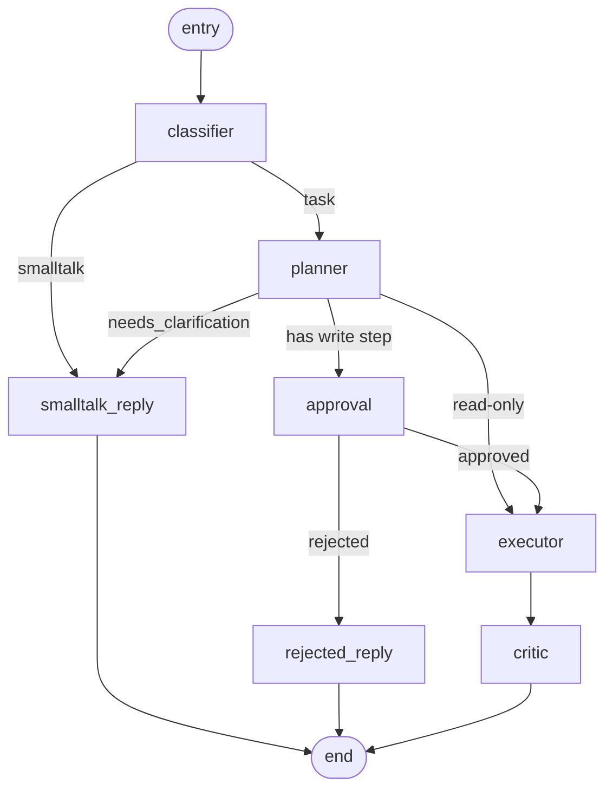

# Lyralabs

> A Python-first, Slack-native autonomous AI coworker. Plans multi-step work,
> calls real tools (GoHighLevel + Google Workspace), pauses for human approval
> on writes, and ships board-ready artifacts (PDFs, charts) back into the
> thread it was asked from.

[](https://www.python.org/)
[](https://fastapi.tiangolo.com/)
[](https://langchain-ai.github.io/langgraph/)
[](#testing)
[](#license)

---

## Table of contents

- [What it does](#what-it-does)
- [Architecture](#architecture)
- [Repository layout](#repository-layout)
- [The agent (LangGraph)](#the-agent-langgraph)
- [Tools](#tools)
- [Channels](#channels)
- [Tenancy and security](#tenancy-and-security)
- [Memory](#memory)
- [Data model](#data-model)
- [Local development](#local-development)
- [Configuration](#configuration)
- [Running migrations](#running-migrations)
- [Useful scripts](#useful-scripts)
- [Testing](#testing)
- [Deployment](#deployment)
- [Day-1 launch blockers](#day-1-launch-blockers)
- [Roadmap](#roadmap)
- [Documentation](#documentation)
- [License](#license)

---

## What it does

You `@mention` the bot in Slack with a real ask:

> *"@ARLO, pull the deals stuck in 'Negotiation' for >7 days from our HighLevel pipeline, draft a follow-up SMS for each, and put it in a Google Doc for me to review."*

The agent:

1. **Classifies** the message (smalltalk vs. real task vs. clarification).
2. **Plans** the steps using a tool catalog (Qwen-Max primary, Qwen-Turbo for cheap calls — both via DashScope through LiteLLM, swappable per env var).
3. **Pauses for approval** if any step writes to a third party (creates docs, sends SMS, books appointments). Posts a Block Kit preview to the same thread.
4. On *Approve*, **executes** each step in dependency order, resolving `{{ step_1.field }}` placeholders into later step args.
5. **Lifts artifacts** (PDFs, PNG charts) generated by tools onto state and uploads them as Slack files.
6. **Critiques** the result, posts a friendly summary back, and records every tool call to an append-only audit log.

All durably checkpointed in Postgres so an approval pause can survive worker restarts and the agent can be resumed hours later from where it stopped.

---

## Architecture

```
       Slack          ┌────────────────────────────┐                  Celery worker
   ────────────────► │  apps/api  (FastAPI)        │ ──── enqueue ──► ┌─────────────────────┐
   /slack/events     │  - /slack/events            │                  │  apps/worker        │
   buttons + msgs    │  - /oauth/{slack,google,ghl}│                  │  run_agent task     │
                     │  - /webhooks/stripe         │                  │  resume_agent task  │
                     │  - /admin/*  (REST)         │                  └─────────┬───────────┘
                     └──────────────┬──────────────┘                            │
                                    ▲                                           ▼
                                    │ CORS                          ┌────────────────────────┐
            Vite SPA (separate repo: ../lyralabs-admin-ui)         │  LangGraph agent       │
                                                                    │  classifier ─► planner │
                            ┌──────────────┐                       │  ─► approval (gate)    │
                            │  Postgres    │ ◄──── checkpoints ───►│  ─► executor ─► critic │
                            │  + Alembic   │                       │  ─► smalltalk_reply    │
                            │  + LangGraph │                       └─────────┬──────────────┘
                            │  checkpointer│                                 │
                            └──────────────┘                                 │
                                    ▲                                        ▼
                                    │                              ┌──────────────────────┐
                            ┌──────────────┐                       │  Tools               │
                            │  Audit log   │ ◄─── tool_call event ─│  google.* (Drive,    │
                            │              │                       │   Docs, Sheets, Cal) │
                            │  IntegrConn  │ ──── creds ──────────►│  ghl.*    (Contacts, │
                            │  (encrypted) │                       │   Pipelines, SMS,    │
                            └──────────────┘                       │   Calendars)         │
                                                                   │  artifact.* (PDF,    │
                                                                   │   chart.line, .bar)  │
                                                                   └──────────┬───────────┘
                                                                              │
                                                                              ▼
                                                                       Slack file upload
                                                                       (PDF / PNG)
```

**Two deployable services in this repo**

| Service   | Tech          | Runs on                                | Responsibility                                                                  |
| --------- | ------------- | -------------------------------------- | ------------------------------------------------------------------------------- |
| `api`     | FastAPI 0.115 | Cloud Run (`lyralabs-app`)             | Webhooks (Slack, Stripe), OAuth callbacks, admin REST API.                      |
| `worker`  | Celery 5.4    | GCE VM (`lyralabs-worker`, `e2-small`) | Run the LangGraph agent for each enqueued user request; resume on approval.    |

The two services share **one Docker image** built from the root `Dockerfile`. The
worker just overrides the default `CMD` with `celery -A apps.worker.celery_app:celery worker ...`.
The VM also hosts the Redis broker that the API talks to (see [`infra/vm/`](infra/vm/));
this hybrid topology keeps Slack response times under 3 s on Cloud Run while
avoiding HTTP-shaped health-check costs for the always-polling worker.

**Admin UI (separate repo)**

The operator panel — a Vite + React 18 + React Router + Tailwind SPA — lives
in [`../lyralabs-admin-ui`](../lyralabs-admin-ui/) and ships to **Vercel** as a
static site. It calls this API cross-origin; the FastAPI CORS allow-list
(`ADMIN_BASE_URL`) must include the deployed UI's origin (e.g.
`https://lyralabs.vercel.app`).

**Backing services**

- Postgres 16 (tenants, users, integrations, jobs, audit, LangGraph checkpoints) — Supabase pooler in prod.
- Redis 7 (Celery broker + result backend) — self-hosted on the worker VM via `docker compose` (AOF persistence, AUTH password, `allkeys-lru`). Migrate to Upstash / Memorystore later if SLAs demand it.
- Qdrant (per-tenant vector index) — Qdrant Cloud or self-hosted.
- Stripe (subscriptions + portal).
- LiteLLM router — currently Qwen (`dashscope/qwen-max` primary, `dashscope/qwen-turbo` cheap) + OpenAI for embeddings. Anthropic Claude / Gemini Flash are drop-in alternatives via `LLM_PRIMARY_MODEL` / `LLM_CHEAP_MODEL`.

---

## Repository layout

```
lyralabs/
├── apps/
│   ├── api/                       FastAPI app
│   │   ├── main.py                Mounts Slack, OAuth, Stripe, admin routers
│   │   ├── stripe_webhook.py      Handles subscription / invoice events
│   │   ├── admin/
│   │   │   ├── auth.py            JWT-bearing admin principal dependency
│   │   │   └── routes.py          /me, /integrations, /jobs, /audit, /cost, /billing/*
│   │   └── oauth/
│   │       ├── _state.py          Signed JWT state for OAuth round-trips
│   │       ├── google.py          /oauth/google/{install,callback}
│   │       └── ghl.py             /oauth/ghl/{install,callback}
│   └── worker/                    Celery
│       ├── celery_app.py          Celery instance + queue routing
│       └── tasks/run_agent.py     run_agent + resume_agent task entrypoints
│
│   (The admin UI lives in a sibling repo: ../lyralabs-admin-ui)
│
├── packages/
│   └── lyra_core/             Shared library
│       ├── common/
│       │   ├── config.py          pydantic-settings: env + provider scopes
│       │   ├── crypto.py          HKDF per-tenant Fernet key derivation
│       │   ├── llm.py             LiteLLM router + cost extractor
│       │   ├── audit.py           Append-only audit log helper
│       │   └── logging.py         Structlog config
│       ├── db/
│       │   ├── models.py          SQLAlchemy 2.0 ORM (Tenant, User, IntegrationConnection, …)
│       │   └── session.py         Async engine + FastAPI dependency
│       ├── channels/
│       │   ├── schema.py          InboundMessage / OutboundReply / Artifact (channel-agnostic)
│       │   ├── slack/
│       │   │   ├── adapter.py     slack_bolt App + event handlers + interactivity
│       │   │   ├── install_store.py  Postgres-backed InstallationStore (encrypted tokens)
│       │   │   └── poster.py      Outbound poster: chat.postMessage + files_upload_v2
│       │   └── teams/adapter.py   Phase-2 placeholder
│       ├── tools/
│       │   ├── base.py            Tool[InputT, OutputT] interface, ApprovalRequired, ToolError
│       │   ├── registry.py        default_registry + auto-discovery via package import
│       │   ├── credentials.py     ProviderCredentials loader + refresh (Google + GHL)
│       │   ├── google/            drive, docs, sheets, calendar (+ _client builders)
│       │   ├── ghl/               client, contacts, pipelines, conversations, calendars
│       │   └── artifacts/         pdf (markdown→HTML→WeasyPrint), chart (Plotly + kaleido)
│       └── agent/
│           ├── state.py           AgentState TypedDict + Plan / PlanStep / StepResult
│           ├── memory.py          4-tier memory (workspace facts + Qdrant collection)
│           ├── checkpointer.py    LangGraph Postgres checkpointer wrapper
│           ├── graph.py           Wires the StateGraph
│           └── nodes/             classifier, planner, approval, executor, critic, smalltalk, artifact
│
├── tests/
│   ├── conftest.py                Env shim + shared fixtures (mock_session, make_ctx, patch_chat …)
│   ├── unit/  (379 tests)         One test file per source module — see Testing section
│   └── integration/               Reserved for tests that need real Postgres
│
├── infra/
│   ├── docker-compose.yml         Local: postgres + redis + qdrant + api + worker
│   ├── cloud-run/                 service.yaml per service for `gcloud run deploy`
│   ├── github-actions/            CI: lint + test + build + deploy
│   └── slack-app-manifest.yml     Slack App Directory manifest
│
├── docs/
│   ├── google-oauth-verification.md  Sensitive-scope verification (do this immediately)
│   ├── slack-app-directory-checklist.md
│   ├── launch-runbook.md          Beta launch playbook
│   ├── demo-scenarios.md          Concrete prompts for testing each phase
│   └── roadmap-phase-2.md         Teams, Stripe-as-a-tool, FB BM, voice via LiveKit
│
├── scripts/
│   └── mint_admin_jwt.py          Dev-only: mint an admin JWT for a tenant
│
├── alembic.ini                    Migrations config
├── Makefile                       gen-key, dev, migrate, test, lint, type, fmt
├── pyproject.toml                 uv/hatch project + ruff + mypy + pytest config
└── .env.example                   Full env var template
```

---

## The agent (LangGraph)



| Node              | Tier     | Role                                                                                       |
| ----------------- | -------- | ------------------------------------------------------------------------------------------ |
| `classifier`      | Cheap    | One-shot JSON classifier: `smalltalk` / `task` / `clarification`.                          |
| `planner`         | Primary  | Emits a `Plan` of `PlanStep`s referencing the live tool catalog. Can request clarification.|
| `approval`        | —        | If any step has `requires_approval=True`, post Block Kit preview + `interrupt()` graph.    |
| `executor`        | —        | Walks steps in order, resolves `{{ step_X.field }}` placeholders, runs `tool.safe_run()`. |
| `critic`          | Primary  | Validates results against the original ask, writes a friendly summary, attaches artifacts. |
| `smalltalk_reply` | Cheap    | Greetings / clarifying questions back to the user.                                         |
| `rejected_reply`  | —        | Acknowledges rejection and asks what to change.                                            |

**State** (`AgentState`, TypedDict, total=False):
```
tenant_id, job_id, channel_id, thread_id, user_id, user_request,
classification, plan, step_results, approval_decision,
final_summary, artifacts, error, total_cost_usd, messages
```

**Checkpointing**: every node return is persisted by the LangGraph Postgres checkpointer keyed by `thread_id`. When `interrupt()` fires inside `approval`, the worker exits cleanly and the graph can be resumed days later via `Command(resume={"decision": "approved"})`.

---

## Tools

Every tool is a `Tool[InputT, OutputT]` with a Pydantic input/output schema, a unique name, and an optional `requires_approval` flag. They self-register in `default_registry` at import time, and the planner's tool catalog is generated from that registry — new tools light up automatically.

### Read-only (no approval)

| Tool                              | What it does                                                              |
| --------------------------------- | ------------------------------------------------------------------------- |
| `google.drive.search`             | Full-text Drive search with optional MIME filter.                         |
| `google.drive.read`               | Read file content. Native docs auto-export to `text/plain` or `text/csv`. |
| `google.sheets.read`              | Read an A1 range; returns rows + dimensions.                              |
| `ghl.contacts.search`             | Search by name / email / phone, capped to `pageLimit`.                    |
| `ghl.pipelines.opportunities`     | List opportunities; supports `stuck_for_days` filter.                     |

### Write (require approval)

| Tool                              | What it does                                                              |
| --------------------------------- | ------------------------------------------------------------------------- |
| `google.docs.create`              | Create a Doc with a title + body, optionally move to a Drive folder.      |
| `google.sheets.append`            | Append rows to a Sheet (`USER_ENTERED` or `RAW`).                         |
| `google.calendar.create_event`    | Insert an event with attendees + sendUpdates=all.                         |
| `ghl.contacts.create`             | Create a contact (requires email or phone).                               |
| `ghl.conversations.send_message`  | SMS or Email to a contact (subject required for Email).                   |
| `ghl.calendars.book_appointment`  | Book a confirmed appointment with a contact.                              |

### Artifact generators

| Tool                              | What it does                                                              |
| --------------------------------- | ------------------------------------------------------------------------- |
| `artifact.pdf.from_markdown`      | Markdown → HTML (mini parser) → WeasyPrint A4 PDF. Side-effect: lifts onto `state.artifacts`. |
| `artifact.chart.line`             | Multi-series Plotly line chart → PNG via kaleido.                         |
| `artifact.chart.bar`              | Single-series Plotly bar chart → PNG via kaleido.                         |

The executor lifts whatever the tool put into `ctx.extra["artifacts"]` onto the agent's `state.artifacts`, and the critic node attaches them to the outbound Slack reply (`files_upload_v2`).

### GHL transport

`tools/ghl/client.py` is a thin async httpx wrapper:

- Adds `Authorization`, `Version: 2021-07-28`, `Accept: application/json` headers.
- Retries on `429` and `5xx` with `tenacity` exponential backoff (max 3 attempts).
- Raises `ToolError` on `4xx` (other than 429), returns parsed JSON otherwise.

### Google transport

`tools/google/_client.py` builds googleapiclient services from a `ProviderCredentials`. All synchronous Google calls run via `asyncio.to_thread` so they never block the event loop.

---

## Channels

```python
class InboundMessage(BaseModel):
    surface: Surface             # "slack" | "teams"
    tenant_external_id: str      # T0123 (Slack team_id)
    channel_id: str              # C0123
    thread_id: str               # message ts
    user_id: str                 # U0123
    text: str
    files: list[dict] = []
    raw: dict = {}
```

The Slack adapter (`channels/slack/adapter.py`) handles `app_mention`, DM `message`, the `/arlo` slash command, and the `approval` button action. On install, tokens are encrypted with the per-tenant Fernet key and stored in `slack_installations`. On uninstall / token revoke, the workspace is marked cancelled and tokens are zeroed.

The Teams adapter is a stub for Phase 2; the channel-agnostic schema means the agent core needs no changes to support it.

---

## Tenancy and security

- **Per-tenant token encryption.** Every OAuth access/refresh token is encrypted with a Fernet key derived per-tenant via HKDF-SHA256 from a single master key. A bug in tenant `A` cannot decrypt tenant `B`'s tokens (verified in `test_crypto.py::TestTenantIsolation`).
- **Append-only audit log.** Every tool call records `tenant_id`, `actor_user_id`, `job_id`, `tool_name`, SHA-256 args hash, cost, and status. Optionally store raw args (off by default for privacy).
- **JWT admin auth.** The admin REST API requires `Authorization: Bearer <jwt>` signed with `ADMIN_JWT_SECRET`, with `tenant_id` and `email` claims, scoped strictly to the caller's tenant.
- **Signed OAuth state.** OAuth round-trips carry a 10-minute JWT `state` so a callback on a stolen URL can't attach to the wrong tenant.
- **Approval gate.** Any tool with `requires_approval=True` triggers `interrupt()`; nothing mutates without an explicit Slack button click.
- **Trial credit limit.** Each tenant gets `STRIPE_TRIAL_CREDIT_USD` (default $100) of free LLM + tool spend, tracked via the audit log's `cost_usd`.

---

## Memory

Four tiers, all per-tenant:

1. **Working memory** — LangGraph state for the current turn. Volatile.
2. **Session memory** — LangGraph Postgres checkpointer keyed by `thread_id`. Survives interrupts.
3. **Workspace memory** — Durable per-tenant facts (`team_slug`, default Drive folder, etc.) in `tenants.settings.facts` JSONB. Helpers: `get_workspace_facts(tenant_id)` / `upsert_workspace_fact(tenant_id, key, value)`.
4. **Semantic memory** — Per-tenant Qdrant collection `tenant_<uuid>` for RAG over their docs. `ensure_tenant_collection()` is idempotent.

---

## Data model

```
tenants ◄──┬─── users
           ├─── slack_installations
           ├─── integration_connections   (provider: "google" | "ghl" | …)
           └─── jobs ─── audit_events
```

Notable details:

- `Tenant.external_team_id` is unique → maps to Slack `team_id` or Teams tenant id.
- `IntegrationConnection` has a unique `(tenant_id, provider, external_account_id)` — re-auth updates in place.
- `Job.thread_id` is the LangGraph thread key; `(tenant_id, thread_id)` are indexed for cheap admin lookups.
- `AuditEvent` has a composite `(tenant_id, ts)` index for the per-tenant timeline view.

Migrations live in `packages/lyra_core/db/migrations/` (Alembic) and are run via `make migrate`.

---

## Local development

### Prerequisites

- Docker Desktop (Postgres + Redis + Qdrant + api + worker)
- Python 3.14+ (only needed if you want to run pytest / scripts on the host)
- Node 20+ (only for the admin-ui — `npm run dev` in `../lyralabs-admin-ui`)
- `uv` (fast pip alternative, optional but recommended)

### Boot the stack

```bash
# 1. Generate a Fernet key + copy env template
make gen-key                     # paste output into .env
cp .env.example .env             # then fill in Slack/Google/GHL/DashScope/OpenAI creds

# 2. Bring up Postgres + Redis + Qdrant + api (uvicorn --reload) + worker
docker compose -f infra/docker-compose.yml up --build

# 3. Apply migrations (in another terminal)
docker compose -f infra/docker-compose.yml exec api alembic upgrade head

# 4. (separate repo) Run the Vite admin UI on :5173 with /admin /oauth
#    /webhooks proxied to FastAPI on :8000.
cd ../lyralabs-admin-ui && npm install && npm run dev
```

The api will be at `http://localhost:8000` (`/healthz`, `/readyz`, `/docs` for Swagger UI). The admin UI runs in its own repo at `http://localhost:5173`.

### Install dev deps locally (for fast unit tests outside docker)

```bash
uv venv .venv
source .venv/bin/activate
uv pip install -e ".[dev]"
make test                         # 379 tests, ~8s
```

---

## Configuration

Every setting is loaded from environment variables via `pydantic-settings` in `packages/lyra_core/common/config.py`. The full list lives in `.env.example`; the most important ones:

| Var                              | Required | Notes                                                                |
| -------------------------------- | -------- | -------------------------------------------------------------------- |
| `MASTER_ENCRYPTION_KEY`          | ✅       | Base64 Fernet key. **Generate via `make gen-key`. Rotate via `reencrypt_with_rotation`.** |
| `DATABASE_URL` / `..._SYNC`      | ✅       | asyncpg + psycopg variants for app + Alembic.                        |
| `CELERY_BROKER_URL` / `CELERY_RESULT_BACKEND` | ✅ | Redis URLs. In prod both point at the worker VM's Redis (see [`infra/vm/`](infra/vm/)). Locally docker-compose wires `redis://redis:6379/0`. |
| `DASHSCOPE_API_KEY`              | ✅       | Primary + cheap tier (Qwen via DashScope).                           |
| `OPENAI_API_KEY`                 | ✅       | Embeddings (`text-embedding-3-small`) — no chat usage on the MVP path.|
| `LLM_PRIMARY_MODEL`              |          | Default `dashscope/qwen-max`. Any LiteLLM-supported model.           |
| `LLM_CHEAP_MODEL`                |          | Default `dashscope/qwen-turbo`.                                      |
| `SLACK_CLIENT_ID/SECRET/SIGNING_SECRET` | ✅ for Slack channel | Without them the api boots in stub mode (no /oauth/slack). |
| `GOOGLE_OAUTH_CLIENT_ID/SECRET`  | ✅ for Google | Plus `GOOGLE_OAUTH_REDIRECT_URI` and the scope CSV.              |
| `GHL_CLIENT_ID/SECRET`           | ✅ for GHL | Marketplace credentials.                                              |
| `STRIPE_*`                       | ✅ for billing | Secret key, webhook secret, monthly price id.                    |
| `ADMIN_JWT_SECRET`               | ✅       | Signs both admin JWTs and OAuth state JWTs.                          |
| `ADMIN_BASE_URL`                 | ✅       | Origin of the deployed admin UI (added to CORS allow-list).          |
| `QDRANT_URL/API_KEY`             | ⚠️       | Only needed when you wire RAG.                                       |

`APP_ENV=test` flips Celery into eager mode, so unit tests run synchronously without a broker.

`LLM_PRIMARY_MODEL` / `LLM_CHEAP_MODEL` are now **bootstrap-only** — once an operator configures providers via the super-admin UI (`/admin/llm/...`), the runtime values in Postgres take over. See the next section.

---

## LLM provider switching (super-admin)

Models are no longer hard-coded to a single vendor. The platform super-admin can switch the live `primary` / `cheap` / `embedding` model at runtime — no redeploy — across any provider in [`packages/lyra_core/llm/catalog.py`](packages/lyra_core/llm/catalog.py): Qwen, DeepSeek, OpenAI, Anthropic, Gemini, Moonshot/Kimi, MiniMax, Z.AI/GLM. Adding a new provider after a release announcement is one entry in the catalog.

**Architecture (3 pieces):**

1. **`packages/lyra_core/llm/catalog.py`** — declarative registry. Model id (LiteLLM format), default endpoint, context window, tier hint. Pure data, no DB.
2. **DB tables** (`llm_providers` + `llm_model_assignments`, migration `0002`) — encrypted credentials per provider, plus a singleton row per tier saying which `(provider, model)` is live.
3. **`packages/lyra_core/llm/router.py`** — runtime resolver with a 30-s in-process cache; `common.llm.chat()` calls into it and passes `api_key=` / `api_base=` per call (no env-var mutation, prefork-safe). Falls back to env vars if no DB row exists, so the migration is safe to ship before the operator touches anything.

**REST API** (gated by `role: "super_admin"` in the JWT):

| Method | Path | Purpose |
|--------|------|---------|
| `GET` | `/admin/llm/catalog` | All providers + known models the code knows about. |
| `GET` | `/admin/llm/providers` | Catalog merged with DB state (configured / has_api_key / last test). Never returns the API key. |
| `PUT` | `/admin/llm/providers/{key}` | Set or clear the API key, optional `api_base`, `extra_config`. |
| `DELETE` | `/admin/llm/providers/{key}` | Remove credentials (rejected with 409 if still assigned to a tier). |
| `POST` | `/admin/llm/providers/{key}/test` | Send a 4-token ping to verify the credentials. |
| `GET` | `/admin/llm/active` | Current tier → model assignments. |
| `PUT` | `/admin/llm/active/{tier}` | Switch the live model for `primary` / `cheap` / `embedding`. |
| `DELETE` | `/admin/llm/active/{tier}` | Clear the assignment, falling back to env vars. |

Every write invalidates the router cache, so the change propagates to all worker processes within 30 s without any out-of-band signal.

**Bootstrapping the first super-admin:**

```bash
python scripts/mint_admin_jwt.py --tenant <ANY_TENANT_UUID> --email you@platform.com --role super_admin
```

Then in the admin UI, hit `PUT /admin/llm/providers/qwen` with your DashScope key, `PUT /admin/llm/providers/deepseek` with your DeepSeek key, then `PUT /admin/llm/active/primary` to point at e.g. `dashscope/qwen-max` and `PUT /admin/llm/active/cheap` to point at `deepseek/deepseek-chat`. Done — the next message ARLO receives uses the new models.

---

## Running migrations

```bash
# Create a new migration after editing models.py
docker compose -f infra/docker-compose.yml exec api \
    alembic revision --autogenerate -m "describe change"

# Apply
make migrate
# or
docker compose -f infra/docker-compose.yml exec api alembic upgrade head
```

---

## Useful scripts

```bash
# Mint an admin JWT for the local admin UI (DEV ONLY)
python scripts/mint_admin_jwt.py --tenant <TENANT_UUID> --email you@example.com

# Generate a fresh Fernet master key
make gen-key
```

---

## Testing

**379 unit tests, 100% passing in ~8s.** Heavy I/O is mocked (`respx` for httpx, `unittest.mock` for googleapiclient / slack_sdk / weasyprint / plotly / stripe). No external service is hit.

```bash
make test                         # run everything
make test-watch                   # stop on first failure
make test-coverage                # with coverage report
```

### Coverage by module

| Area                                                        | Tests |
| ----------------------------------------------------------- | ----: |
| `common/` (config, crypto, logging, llm, audit)             |    47 |
| `db/` (model schema, defaults, indices, constraints)        |    14 |
| `channels/` (schema, slack adapter/install_store/poster, teams) | 29 |
| `tools/` core (base, registry, credentials)                 |    30 |
| `tools/google/*`                                            |    35 |
| `tools/ghl/*`                                               |    39 |
| `tools/artifacts/*` (pdf markdown, charts)                  |    18 |
| `agent/` (state, memory, all 7 nodes, graph wiring)         |    72 |
| `apps/api/*` (oauth state/google/ghl, admin auth+routes, stripe webhook, main) | 50 |
| `apps/worker/*` (celery config, run_agent, resume_agent)    |    23 |
| **Total**                                                   |  **379** |

### Test design

- **No Postgres required.** DB-touching code uses a `_FakeSession` async-context-manager.
- **FastAPI** tests use `httpx.AsyncClient` + `ASGITransport` and override `Depends(current_admin)` / `Depends(get_session)`.
- **Shared fixtures** in `tests/conftest.py`:
  - `make_ctx` → builds a `ToolContext` with a fake `creds_lookup`
  - `mock_session` / `mock_session_cm` → drop-in `AsyncSession` test double
  - `mock_litellm_response` + `patch_chat` → LLM stubs for node tests
- **Real Postgres-backed integration tests** would live in `tests/integration/`. Keep them out of `make test`.

### Real bugs caught while writing tests

1. `IntegrationConnection` was missing the `tenant` relationship that satisfied `Tenant.integrations.back_populates="tenant"` — would have crashed on first ORM use.
2. `common/logging.py` paired `structlog.stdlib.add_logger_name` with `PrintLogger` (no `.name` attr), throwing `AttributeError` on every error log. Replaced with `processors.add_log_level`.

---

## Deployment

Hybrid topology: the API runs on Cloud Run (HTTP-shaped, scale-to-N), the worker runs on a single Compute Engine VM alongside its own Redis broker (pull-based, always-on, cheaper than Cloud Run for sustained polling). Same `Dockerfile` for both — only the runtime command differs.

| Service            | Repo                | Where it runs                                       | Image / build source                                                | Deploy trigger                                                                                                                                                |
| ------------------ | ------------------- | --------------------------------------------------- | ------------------------------------------------------------------- | ------------------------------------------------------------------------------------------------------------------------------------------------------------- |
| `api`              | this repo           | Cloud Run (`lyralabs-app`)                          | `./Dockerfile` (default `CMD` runs uvicorn)                         | Cloud Build trigger on `main` → `gcloud run deploy lyralabs-app`. Min instances ≥ 1 so Slack doesn't time out the 3 s ack. See [`infra/cloud-run/README.md`](infra/cloud-run/README.md). |
| `worker` + `redis` | this repo           | GCE VM (`lyralabs-worker`, `e2-small`, ~$13/mo)     | `./Dockerfile` (`command` overridden to `celery worker`)            | Manual: SSH into VM, run `infra/vm/deploy.sh` (pulls fresh image + recreates the worker container). Watchtower / Cloud Build SSH automation is Sprint 2. See [`infra/vm/README.md`](infra/vm/README.md). |
| `admin-ui`         | `lyralabs-admin-ui` | Vercel (`https://lyralabs.vercel.app`)              | `npm run build` (Vercel auto-detected, no Docker)                   | Git push to `main` → Vercel rebuild. `VITE_API_BASE` and other env vars live in the Vercel project settings. Origin must be in `ADMIN_BASE_URL` on this repo. |

Managed dependencies:

- **Postgres** → Supabase pooler (transaction mode for the app, session mode for Alembic).
- **Redis** → self-hosted on the worker VM (`redis:7-alpine`, AOF persistence, AUTH password, `allkeys-lru` 512 MB cap). Migrate to Upstash / Memorystore if reliability SLAs ever justify it.
- **Qdrant** → Qdrant Cloud or a small Compute Engine VM.
- **Stripe** → live mode + webhook to `https://<lyralabs-app cloud-run url>/webhooks/stripe`.

CI gates (GitHub Actions on this repo):

1. `ruff check` + `ruff format --check`
2. `mypy packages apps`
3. `make test` (the full 379-test suite)
4. Build + push image to Artifact Registry (`us-east1-docker.pkg.dev/<project>/lyralabs/lyralabs-app`)
5. `gcloud run deploy lyralabs-app`, blue/green via revisions

The worker VM does **not** auto-pull on every push — it's a manual `deploy.sh`
until Sprint 2's Watchtower poll-and-pull lands. This is intentional: most
agent code changes only need a single `gcloud run deploy` for the API to take
effect, and re-pulling the worker image on every commit churns the VM for no
benefit.

---

## Day-1 launch blockers

Start these the day you decide to ship:

1. **Google OAuth verification** — Sensitive scopes (Drive, Calendar, Sheets) take 4–6 weeks and may require a CASA security audit. See `docs/google-oauth-verification.md`.
2. **Slack App Directory submission** — Begin assets in week 8, submit in week 11. See `docs/slack-app-directory-checklist.md`.
3. **Pakistan SMC-Pvt or US LLC for Stripe** — Talk to an accountant by week 6.

---

## Roadmap

- **Now (Phase 1, MVP):** Slack + Google + GHL, single-brand SaaS.
- **Phase 2 (`docs/roadmap-phase-2.md`):**
  - Microsoft Teams adapter (already a stub; `pip install .[teams]`).
  - Stripe-as-a-tool: agent can issue refunds, send invoices, etc., behind approval.
  - Facebook Business Manager: ads insights + creative drafting.
  - Voice via [LiveKit Agents](https://docs.livekit.io/agents/) (the same agent core, exposed over a phone number).
- **Phase 3:** White-label resellers, fine-tuned per-tenant models, multi-region.

---

## Documentation

- [`docs/launch-runbook.md`](docs/launch-runbook.md) — Beta launch playbook (pre-launch checklist, daily monitoring, iteration cadence).
- [`docs/demo-scenarios.md`](docs/demo-scenarios.md) — Concrete prompts for testing each phase end-to-end.
- [`docs/google-oauth-verification.md`](docs/google-oauth-verification.md) — Sensitive-scope process, CASA audit, evidence checklist.
- [`docs/slack-app-directory-checklist.md`](docs/slack-app-directory-checklist.md) — App Directory submission requirements.
- [`docs/roadmap-phase-2.md`](docs/roadmap-phase-2.md) — Teams, Stripe-as-a-tool, FB BM, voice.

---

## License

Proprietary © Muhammad Sahil. All rights reserved.
