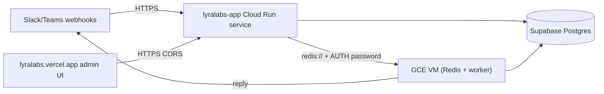

# Cloud Run deployment guide (API only)

`lyralabs-app` (the FastAPI service) runs here on Cloud Run. The Celery
worker does **not** — it runs on a GCE VM alongside its own Redis broker.
See [`../vm/README.md`](../vm/README.md) for the worker setup.

> **History note:** an earlier revision of this guide tried to put the
> worker on Cloud Run as a second service. That doesn't work cleanly —
> Cloud Run **Services** require an HTTP listener on `$PORT`, but a Celery
> worker is pull-based and never opens a port. We pivoted to a single
> `e2-small` VM running both Redis and the worker container. The
> [`worker.yaml`](./worker.yaml) manifest in this folder is kept as
> reference for anyone evaluating Cloud Run **Worker Pools** later (still
> in preview as of 2026).



## Service overview

| Service          | Where it runs       | Inbound        | Runtime command                                  |
| ---------------- | ------------------- | -------------- | ------------------------------------------------ |
| `lyralabs-app`   | Cloud Run, us-east1 | public HTTPS   | `uvicorn apps.api.main:app` (Dockerfile default) |
| `lyralabs-worker`| GCE VM `lyralabs-worker` | none (pull) | `celery -A apps.worker.celery_app:celery worker` |
| `admin-ui`       | Vercel              | public HTTPS   | static SPA (separate repo)                       |

## Updating env vars on `lyralabs-app`

In the GCP Console:

1. Open **Cloud Run → lyralabs-app → Edit & deploy new revision**
2. Scroll to **Variables & Secrets**
3. Add or update env vars.
4. Click **Deploy**.

When you set up the VM (see [`../vm/README.md`](../vm/README.md) Phase 4),
you'll update three vars to point at the VM's static IP:

```
CELERY_BROKER_URL=redis://default:<REDIS_PASSWORD>@<VM_STATIC_IP>:6379/0
CELERY_RESULT_BACKEND=redis://default:<REDIS_PASSWORD>@<VM_STATIC_IP>:6379/0
REDIS_URL=redis://default:<REDIS_PASSWORD>@<VM_STATIC_IP>:6379/0
```

> Never commit the actual values. Pull them from your local `.env` (which
> is gitignored) or from Secret Manager once that's wired up.

## Required env vars on `lyralabs-app`

Every var below must be set. Pull the values from your local `.env`.

### App
| Var               | Value                                                                  |
| ----------------- | ---------------------------------------------------------------------- |
| `APP_ENV`         | `production`                                                           |
| `LOG_LEVEL`       | `INFO`                                                                 |
| `APP_BASE_URL`    | `https://lyralabs-app-876710803394.us-east1.run.app`                   |
| `ADMIN_BASE_URL`  | `https://lyralabs.vercel.app`                                          |

### Storage
| Var                     | Source                                                                                   |
| ----------------------- | ---------------------------------------------------------------------------------------- |
| `DATABASE_URL`          | local `.env` — Supabase pooler asyncpg URL (port 6543)                                   |
| `DATABASE_URL_SYNC`     | local `.env` — Supabase psycopg URL (port 5432)                                          |
| `REDIS_URL`             | `redis://default:<REDIS_PASSWORD>@<VM_STATIC_IP>:6379/0` (after Phase 4)                 |
| `CELERY_BROKER_URL`     | same as `REDIS_URL`                                                                      |
| `CELERY_RESULT_BACKEND` | same as `REDIS_URL`                                                                      |

### Crypto
| Var                     | Source                                                                                   |
| ----------------------- | ---------------------------------------------------------------------------------------- |
| `MASTER_ENCRYPTION_KEY` | local `.env` — must match the value on the worker VM                                     |
| `ADMIN_JWT_SECRET`      | local `.env`                                                                             |
| `ADMIN_JWT_ISSUER`      | `lyralabs-admin`                                                                         |

### LLM
| Var                  | Value                                                            |
| -------------------- | ---------------------------------------------------------------- |
| `LLM_PRIMARY_MODEL`  | `dashscope/qwen-max`                                             |
| `LLM_CHEAP_MODEL`    | `dashscope/qwen-turbo`                                           |
| `QWEN_API_KEY`       | local `.env`                                                     |
| `QWEN_API_BASE`      | `https://dashscope-intl.aliyuncs.com/compatible-mode/v1`         |

### Slack
| Var                          | Source                                                                        |
| ---------------------------- | ----------------------------------------------------------------------------- |
| `SLACK_CLIENT_ID`            | local `.env`                                                                  |
| `SLACK_CLIENT_SECRET`        | local `.env`                                                                  |
| `SLACK_SIGNING_SECRET`       | local `.env`                                                                  |
| `SLACK_SCOPES`               | full CSV from local `.env`                                                    |
| `SLACK_INSTALL_REDIRECT_URL` | `https://lyralabs-app-876710803394.us-east1.run.app/oauth/slack/callback`     |

### Tool integrations (fill in when each goes live)
- `GOOGLE_OAUTH_CLIENT_ID`, `GOOGLE_OAUTH_CLIENT_SECRET`, `GOOGLE_OAUTH_REDIRECT_URI`, `GOOGLE_OAUTH_SCOPES`
- `GHL_CLIENT_ID`, `GHL_CLIENT_SECRET`, `GHL_REDIRECT_URI`, `GHL_SCOPES`
- `STRIPE_SECRET_KEY`, `STRIPE_WEBHOOK_SECRET`, `STRIPE_PRICE_ID_TEAM_MONTHLY`, `STRIPE_TRIAL_CREDIT_USD`

## Deferred to Sprint 2

- Migrate env vars to Secret Manager (single source, audit trail, rotation)
- Wire `cloudbuild.yaml` so one push deploys API + worker (the worker side will SSH into the VM and `docker compose pull && up`)
- Rename `lyralabs-app` → `lyralabs-api` (requires updating the Slack manifest URL + Vercel `VITE_API_BASE`)
- Dedicated service accounts with narrower IAM bindings
- Re-evaluate Cloud Run **Worker Pools** + CREMA once they leave preview (Q3 2026 most likely)
